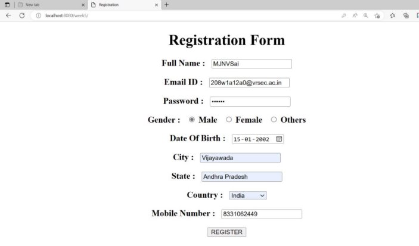

**INDEX** 

<table><tr><th colspan="1" rowspan="2">Sl. No </td><th colspan="1" rowspan="2">Exp. No. </td><th colspan="1" rowspan="2">Date </td><th colspan="1" rowspan="2">Name of the Experiment </td><th colspan="1" rowspan="2">Page No. </td><th colspan="2">Marks </td><th colspan="1" rowspan="1">Date of Submission Sign </td></tr>
<tr></td></td></td></td></td><td colspan="1">Remarks </td><td colspan="1">Viva </td></td></tr>
<tr><td colspan="1">1 </td><td colspan="1">1 </td><td colspan="1">03-01-23 </td><td colspan="1">Programs on MSAccess Crud Operations </td><td colspan="1"></td><td colspan="1"></td><td colspan="1"></td><td colspan="1"></td></tr>
<tr><td colspan="1">2 </td><td colspan="1">1 </td><td colspan="1">24-01-23 </td><td colspan="1">Programs on Mysql CRUD Operations </td><td colspan="1"></td><td colspan="1"></td><td colspan="1"></td><td colspan="1"></td></tr>
<tr><td colspan="1">3 </td><td colspan="1">1 </td><td colspan="1">31-01-23 </td><td colspan="1">Programs on Prepared Statement Interface </td><td colspan="1"></td><td colspan="1"></td><td colspan="1"></td><td colspan="1"></td></tr>
<tr><td colspan="1">4 </td><td colspan="1">1 </td><td colspan="1">07-02-23 </td><td colspan="1">Using Servlets Create Login Application </td><td colspan="1"></td><td colspan="1"></td><td colspan="1"></td><td colspan="1"></td></tr>
<tr><td colspan="1">5 </td><td colspan="1">1 </td><td colspan="1">14-02-23 </td><td colspan="1">Using Servlets Create Registration Application </td><td colspan="1"></td><td colspan="1"></td><td colspan="1"></td><td colspan="1"></td></tr>
<tr><td colspan="1" rowspan="2">6 </td><td colspan="1" rowspan="2">1 </td><td colspan="1" rowspan="2">21-02-23 </td><td colspan="1">Web application user enters number retrive and print in servlet </td><td colspan="1"></td><td colspan="1"></td><td colspan="1"></td><td colspan="1"></td></tr>
<tr></td></td></td><td colspan="1">Web application To Update employee details through database interaction for user form </td><td colspan="1"></td><td colspan="1"></td><td colspan="1"></td><td colspan="1"></td></tr>
<tr><td colspan="1" rowspan="2">7 </td><td colspan="1" rowspan="2">1 </td><td colspan="1" rowspan="2">28-02-23 </td><td colspan="1">Web application user enter details and insert into database </td><td colspan="1"></td><td colspan="1"></td><td colspan="1"></td><td colspan="1"></td></tr>
<tr></td></td></td><td colspan="1">Web application to print the range of salary in servlets from database </td><td colspan="1"></td><td colspan="1"></td><td colspan="1"></td><td colspan="1"></td></tr>
<tr><td colspan="1">8 </td><td colspan="1">1 </td><td colspan="1">01-03-23 </td><td colspan="1" valign="top">
Programs on Cookies and 

`                 `Bank Transfer Fund Application 
</td><td colspan="1"></td><td colspan="1"></td><td colspan="1"></td><td colspan="1"></td></tr>
<tr><td colspan="1">9 </td><td colspan="1">1 </td><td colspan="1">08-03-23 </td><td colspan="1">Programs on Session Creation and Session Sharing </td><td colspan="1"></td><td colspan="1"></td><td colspan="1"></td><td colspan="1"></td></tr>
<tr><td colspan="1">10 </td><td colspan="1">1 </td><td colspan="1">14-03-23 </td><td colspan="1">Spring Boot and Eclipse Installation </td><td colspan="1"></td><td colspan="1"></td><td colspan="1"></td><td colspan="1"></td></tr>
<tr><td colspan="1">11 </td><td colspan="1">1 </td><td colspan="1">21-03-23 </td><td colspan="1">Programs on Spring Boot Controllers </td><td colspan="1"></td><td colspan="1"></td><td colspan="1"></td><td colspan="1"></td></tr>
<tr><td colspan="1">12 </td><td colspan="1">1 </td><td colspan="1">29-03-23 </td><td colspan="1">Program on Interacting With In – memory Database </td><td colspan="1"></td><td colspan="1"></td><td colspan="1"></td><td colspan="1"></td></tr>
<tr><td colspan="1">13 </td><td colspan="1">1 </td><td colspan="1">04-04-23 </td><td colspan="1">Implementing @Bean and @Autowired Constructor Injection </td><td colspan="1"></td><td colspan="1"></td><td colspan="1"></td><td colspan="1"></td></tr>
<tr><td colspan="1">14 </td><td colspan="1">1 </td><td colspan="1">12-04-23 </td><td colspan="1">Implementing @Autowired Setter and Field Injection </td><td colspan="1"></td><td colspan="1"></td><td colspan="1"></td><td colspan="1"></td></tr>
<tr><td colspan="1">15 </td><td colspan="1">1 </td><td colspan="1">19-04-23 </td><td colspan="1">Implementing @Primary and @Qualifer Annotations </td><td colspan="1"></td><td colspan="1"></td><td colspan="1"></td><td colspan="1"></td></tr>
</table>

67 

**WEEK – 1**

**Aim :** Create a JDBC application which connects with an MS Access database and perform              CRUD Operations. 

**Program :** 

package javadbc; 

import java.io.\*; 

import java.sql.\*; 

public class JavaDBC { 

`    `public static void main(String[] args)  

`    `{ 

`        `try 

`        `{ 

`            `Class.forName("net.ucanaccess.jdbc.UcanaccessDriver");              // E:\venkat sai\WebDev\_Program\JDBC.accdb 

`            `Connection con = DriverManager.getConnection("jdbc:ucanaccess://E:\\venkat sai\\WebDev\_Program\\JDBC.accdb"); 

Statement st = con.createStatement(); 

// Insert Query; 

String sqlinsert = "insert into Employee values(68, 'A. Charan', 208456732, 95000)"; st.executeUpdate(sqlinsert); 

// update Query 

String sqlupdate = "update Employee set salary = 70000 where ID = 68"; //st.executeUpdate(sqlupdate); 

// Delete record Query 

String sqldelete = "delete from Employee where id = 4"; 

`            `//st.executeUpdate(sqldelete);   

`            `// Create Query 

`            `String sqlcreate = "CREATE TABLE REGISTRATION " + 

`                   `"(id INTEGER not NULL, " + 

- first VARCHAR(255), " +  
- last VARCHAR(255), " +  
- age INTEGER, " +  
- PRIMARY KEY ( id ))"; 

`            `//st.executeUpdate(sqlcreate); 

`            `// Select Query 

`            `ResultSet rs = st.executeQuery("select \* from Employee"); 

`            `while(rs.next()) 

`            `{ 

`                `System.out.println("Employee ID Number is: " + rs.getInt(1)); 

`                `System.out.println("Employee name is: " + rs.getString(2)); 

`                `System.out.println("Employee Mobile Number : " + rs.getInt(3));                 System.out.println("Employee Salary : " + rs.getInt(4)); 

`                `System.out.println(); 

`            `} 

`        `} 

`        `catch(Exception e) 

`        `{ 

`            `System.out.println("An unknown Exception occured : \n\n" + e); 

`        `} 

`    `} 

`    `}   

**Output :**     

**Select Query** 

**Update Query**  

**Delete Query :** 

**Create Query :** 

**Result :** Sucessfully Executed the Program. 

**Week – 2** 

**Aim :**  Create a JDBC application which connects with an Mysql database and perform              CRUD Operations. 

**Program :** 

package javadbc; 

import java.io.\*; 

import java.sql.\*; 

import java.util.\*; 

public class MySql  

{ 

`    `public static void main(String[] args) 

`    `{ 

`        `try 

`        `{ 

`            `Scanner s = new Scanner(System.in);             System.out.print("Enter Eno : "); 

`            `int a = s.nextInt(); 

`            `System.out.print("Enter Ename : ");             String ss = s.next(); 

Class.forName("com.mysql.jdbc.Driver");  

`            `Connection con = DriverManager.getConnection("jdbc:mysql://localhost/it","root","");  

Statement st = con.createStatement(); 

// Statement is an Interface and Connection is an Child Class 

//Create Database 

String sqldb = "create database 208W1A12A0"; //st.executeUpdate(sqldb); 

//Create table 

String sqltable = "create table employee (eno int, name varchar(20))"; //st.executeUpdate(sqltable); 

// Insert Records 

String sqlinsert = "insert into employee values(4,'kumar')"; //st.executeUpdate(sqlinsert); 

String insertdynamic = "insert into employee values("+a+", '"+ss+"')"; //st.executeUpdate(insertdynamic); 

// Update Query 

String sqlupdate = "update employee set name='charan' where eno=268"; //st.executeUpdate(sqlupdate); 

// Delete Query 

String sqldelete = "delete from employee where eno=299"; //st.executeUpdate(sqldelete); 

// Select Query 

ResultSet rs = st.executeQuery("select \* from employee");   while(rs.next())   

`                `System.out.println(rs.getInt(1) + "  " + rs.getString(2));               con.close();   

`        `} 

`        `catch(Exception e) 

`        `{ 

`            `System.out.println("An unknown Error occured : \n" + e);         } 

`    `} 

} 

**Output :** 

**Create Query :** 

**Insert Query :** 

**Update Query :** 

**Delete Query :** 

**Result :** Sucessfully Executed the Program. 

**Week – 3** 

**Aim :**  Create a JDBC application and insert the records into Mysql database By using the               PreparedStatement interface. 

**Program :** 

package javadbc; 

import java.io.\*; 

import java.util.\*; 

import java.sql.\*; 

public class PrepState  

{ 

`    `public static void main(String[] args) 

`    `{ 

`        `try 

`        `{ 

`            `Class.forName("com.mysql.jdbc.Driver");   

`            `Connection con = DriverManager.getConnection("jdbc:mysql://localhost/student","root","");                 

`              `String sqltable = "create table students(roll int, name varchar(50), marks float)";               PreparedStatement ps = con.prepareStatement(sqltable); 

`              `int t = ps.executeUpdate(); 

`              `System.out.println(t); 

String sqlinsert = "insert into students values(?, ?, ?)"; PreparedStatement ps = con.prepareStatement(sqlinsert); ps.setInt(1, 82); 

ps.setString(2, "Sai vamsi"); 

ps.setFloat(3, 95.8f); 

int i = ps.executeUpdate(); 

System.out.println(i); 

String sqlres = "select \* from students"; PreparedStatement ps = con.prepareStatement(sqlres); ResultSet rs = ps.executeQuery(); 

while(rs.next()) 

{ 

`                `System.out.println("Student Roll Number : " + rs.getInt(1));                 System.out.println("Student Name : " + rs.getString(2)); 

`                `System.out.println("Student Marks : " + rs.getFloat(3)); 

`                `System.out.println(); 

`            `} 

`        `} 

`        `catch(Exception e) 

`        `{ 

`            `System.out.println(e); 

`        `} 

`    `} 

} 

**Output :** 

**Create Query :** 

**Insert Query :** 

**Result :** Sucessfully Executed The Program 

**WEEK – 4** 

**Aim :** Create a Login Web Application which interacts with an mysql database and validates              Login credentials of the user. 

**Program :** index.html 

<html> 

`    `<head> 

`        `<title> Just A login </title> 

`        `<meta charset="UTF-8"> 

`        `<meta name="viewport" content="width=device-width, initial-scale=1.0">     </head> 

`    `<body> 

`    `
 

`        `<h1> <b> Login </b> </h1> 

`        `<form action = "Servlet1" method = "GET"> 

`            `<label for = "dfu">  User Name :  </label> 

`            `<input type = "text" name = "u1" />     

<label for = "dfp"> Password : </label>  <input type = "text" name = "u2" />     

`            `<input type = "submit" value = "SUBMIT" />         </form> 

`    `
 

`    `</body> 

</html> 

**Program :** Servlet1.java import javax.servlet.http.\*;   import javax.servlet.\*;   import java.io.\*;   

import java.sql.\*; 

public class Servlet1 extends HttpServlet {   

`    `@Override 

`    `public void doGet(HttpServletRequest req,HttpServletResponse res)  throws ServletException,IOException   

`    `{   

`        `res.setContentType("text/html");//setting the content type  or mine type         PrintWriter pw = res.getWriter();//get the stream to write the data   

//writing html in the stream   //pw.println("<html><body>");   String s1 = req.getParameter("u1"); String s2 = req.getParameter("u2"); 

boolean status = false; 

`        `try 

`        `{ 

`            `Class.forName("com.mysql.jdbc.Driver"); 

`            `Connection con = DriverManager.getConnection("jdbc:mysql://localhost/it", "root", ""); 

String checksql = "select \* from login where user = ? and pass = ?"; PreparedStatement ps = con.prepareStatement(checksql); ps.setString(1, s1); 

ps.setString(2, s2); 

`            `ResultSet rs = ps.executeQuery(); 

`            `while(rs.next()) 

`            `{ 

`                `status = true; 

`            `} 

`            `pw.print("
 <h1> User Login Sucessfull </h1> 
");         } 

`        `catch(Exception e) 

`        `{ 

`            `e.printStackTrace(); 

`        `} 

`    `} 

} 

**Output :** 

**Result :** Sucessfully Executed The Program. 

**Week – 5** 

**Aim :**  Create a Registration Web Application which interacts with Mysql database and               Save them into the Database. 

**Program :**  index.html 

<html> 

`    `<head> 

`        `<title> Registration </title> 

`        `<meta charset="UTF-8"> 

`        `<meta name="viewport" content="width=device-width, initial-scale=1.0">     </head> 

`    `<body> 

`    `
 

`        `<h1> <b> Registration Form </b> </h1> 

`        `<form action = "Servlet1" method = "GET"> 

`            `<h3> Full Name : &nbsp; <input type = "text" name = "r1" /> </h3> 

`            `<h3> Email ID : &nbsp; <input type = "text" name = "r2" /> </h3> 

`            `<h3> Password : &nbsp; <input type = "password" name = "r3" /> </h3> 

`            `<h3> Gender : &nbsp; <input type = "radio" name = "r4" value = "male"/> Male &nbsp; <input type = "radio" name = "r4" value = "male"/> Female &nbsp; <input type = "radio" name = "r4" value = "male"/> Others </h3> 

<h3> Date Of Birth : &nbsp; <input type = "date" name = "r5" /> </h3> <h3> City : &nbsp; <input type = "text" name = "r6" /> </h3> 

<h3> State : &nbsp; <input type = "text" name = "r7" /> </h3> 

`            `<h3> Country : &nbsp;  

`                `<select name = "r8"> 

`                    `<option> India </option> 

`                    `<option> USA </option> 

`                    `<option> Russia </option> 

`                    `<option> Japan </option> 

`                    `<option> Pakisthan </option>                     <option> France </option> 

`                    `<option> Germany </option> 

`                `</select>             </h3> 

<h3> Mobile Number : &nbsp; <input type = "text" name = "r9" /> </h3> <input type = "submit" value = "REGISTER" /> 

`        `</form>     
     </body> </html> 

**Program :**  Servlet1.java 

import javax.servlet.http.\*;   

import javax.servlet.\*;   

import java.io.\*;   

import java.sql.\*; 

public class Servlet1 extends HttpServlet 

{   

`    `@Override 

`    `public void doGet(HttpServletRequest req,HttpServletResponse res)  throws ServletException,IOException   

`    `{   

`        `res.setContentType("text/html");//setting the content type  or mine type         PrintWriter pw = res.getWriter();//get the stream to write the data   

//writing html in the stream   //pw.println("<html><body>");   

String s1 = req.getParameter("r1"); 

String s2 = req.getParameter("r2"); 

String s3 = req.getParameter("r3"); 

String s4 = req.getParameter("r4"); 

String s5 = (String)req.getParameter("r5"); String s6 = req.getParameter("r6"); 

String s7 = req.getParameter("r7"); 

String s8 = req.getParameter("r8"); 

String s9 = req.getParameter("r9"); 

boolean status = false; 

`        `try 

`        `{ 

`            `Class.forName("com.mysql.jdbc.Driver"); 

`            `Connection con = DriverManager.getConnection("jdbc:mysql://localhost/it", "root", ""); 

String checksql = "insert into register values(?, ?, ?, ?, ?, ?, ?, ?, ?)"; PreparedStatement ps = con.prepareStatement(checksql); ps.setString(1, s1); 

ps.setString(2, s2); 

ps.setString(3, s3); 

ps.setString(4, s4); 

ps.setString(5, s5); 

ps.setString(6, s6); 

ps.setString(7, s7); 

ps.setString(8, s8); ps.setString(9, s9); 

`            `int result = ps.executeUpdate();             while(result > 0) 

`            `{ 

`                `status = true; 

`            `} 

`            `pw.print("
 <h1> Your Registration is Sucessfull !!! </h1> 
");         } 

`        `catch(Exception e) 

`        `{ 

`            `e.printStackTrace(); 

`        `} 

`    `} 

} 

**Output :** 

**Result :**  Sucessfully Executed The Program. 

**WEEK - 6** 

**Aim :**  Create a Web application in which user enters an Employee Number and 

`   `fetch the  Employee Information and print it on servlet Page. 

**Program :**   Index.html

<html> 

`    `<head> 

`        `<title> Assignment 1 </title> 

`        `<meta charset="UTF-8"> 

`        `<meta name="viewport" content="width=device-width, initial-scale=1.0">     </head> 

`    `<body> 

`    `
 

`        `<form action = "Servlet1" method = "GET"> 

`            `<h1> <b> Employee Details </b> </h1> 

`            `<label for = "em"> Enter a Employee Number : </label> 

`            `<input type = "text" name = "id" />     

`            `<input type = "submit" value = "SUBMIT" /> 

`        `</form> 

`    `
 

`    `</body> 

</html> 

**Program :** Servlet1.java import javax.servlet.http.\*;   import javax.servlet.\*;   import java.io.\*;   

import java.sql.\*; 

public class Servlet1 extends HttpServlet 

{   

`    `@Override 

`    `public void doGet(HttpServletRequest req,HttpServletResponse res)  throws ServletException,IOException   

`    `{   

`        `res.setContentType("text/html");   //setting the content type  or mine type 

PrintWriter pw=res.getWriter();     //get the stream to write the data  int id = Integer.parseInt(req.getParameter("id")); 

`        `try 

`        `{ 

`            `Class.forName("com.mysql.jdbc.Driver"); 

`            `Connection con = DriverManager.getConnection("jdbc:mysql://localhost/it", "root", ""); 

`            `PreparedStatement ps = con.prepareStatement("select \* from javaemployee where id = ?"); 

`            `ps.setInt(1, id); 

`            `ResultSet rs = ps.executeQuery(); 

`            `while(rs.next()) 

`            `{ 

`                `pw.println("
"); 

`                `pw.println("<h1> Employeee Id : " + rs.getInt(1) + "</h1>    "); 

`                `pw.println("<h1> Employeee Name : " + rs.getString(2) + "</h1>    "); 

`                `pw.println("<h1> Employeee City : " + rs.getString(3) + "</h1>    "); 

`                `pw.println("<h1> Employeee Company : " + rs.getString(4) + "</h1>    "); 

`                `pw.println("<h1> Employeee Salary : " + rs.getFloat(5) + " Lakhs </h1>    ");                 pw.println("
"); 

`            `} 

`        `} 

`        `catch(Exception e) 

`        `{ 

`            `pw.println("An unexcepted Error Occured"); 

`        `} 

`    `} 

} 

**Output :** 

**Aim :** Create a Web Application that provides a web program to an end User and he  

` `should be able to get the details in the form when it is Entered provide the    

`            `update control on the form to update the Employee information in the  

`            `database. 

**Program :**  Index.html 

<html> 

`    `<head> 

`        `<title> Assignment 2 </title> 

`        `<meta charset="UTF-8"> 

`        `<meta name="viewport" content="width=device-width, initial-scale=1.0">     </head> 

`    `<body> 

`    `
 

`        `<h1> <b> Book Details </b> </h1> 

`        `<form action = "Servlet1" method = "GET"> 

`            `<label for = "is"> Enter Book ISBN Number : </label> 

`            `<input type = "text" name = "isbn" />     

`            `<input type = "submit" value = "SUBMIT" /> 

`        `</form> 

`    `
 

`    `</body> 

</html> 

**Program :**  Book.html

<html> 

`    `<head> 

`        `<title> Book Details </title> 

`        `<meta charset="UTF-8"> 

`        `<meta name="viewport" content="width=device-width, initial-scale=1.0">     </head> 

`    `<body> 

`    `
 

`        `<form action = "Servlet2" method = "GET"> 

`            `<h1> <b> Update Book Details In Database </b> </h1> 

`            `<label for = "is1"> Enter ISBN Number : </label> 

<input type="text" name="is1" />     

<label for = "au1"> Enter Book Name : </label> <input type="text" name="au1" />     

<label for = "bo1"> Enter Book Price : </label> <input type="text" name="bo1" />     

`            `<input type = "submit" value = "UPDATE" />         </form> 

`    `
 

`    `</body> 

</html> 

**Program :**  Servlet1.java 

import java.io.IOException; 

import java.io.PrintWriter; 

import javax.servlet.ServletException; 

import javax.servlet.http.HttpServlet; 

import javax.servlet.http.HttpServletRequest; 

import javax.servlet.http.HttpServletResponse; 

import java.io.\*; 

import java.sql.\*; 

public class Servlet1 extends HttpServlet  

{ 

`    `@Override 

`    `protected void doGet(HttpServletRequest request, HttpServletResponse response) throws ServletException, IOException  

`    `{ 

`        `response.setContentType("text/html");          //setting the content type   

`        `PrintWriter pw = response.getWriter();         //get the stream to write the data 

int isbn = Integer.parseInt(request.getParameter("isbn")); 

`        `try 

`        `{ 

`            `Class.forName("com.mysql.jdbc.Driver"); 

`            `Connection con = DriverManager.getConnection("jdbc:mysql://localhost/it", "root", ""); 

`            `PreparedStatement ps = con.prepareStatement("select \* from newbook where isbn = ?"); 

`            `ps.setInt(1, isbn); 

`            `ResultSet rs = ps.executeQuery(); 

`            `while(rs.next()) 

`            `{ 

`                `pw.println("
"); 

`                `pw.println("<h1> Book ISBN Number : " + rs.getInt(1) + "</h1>    ");                 pw.println("<h1> Book Name : " + rs.getString(2) + "</h1>    "); 

`                `pw.println("<h1> Book Price : " + rs.getFloat(3) + "</h1>    "); 

`                `pw.println("
"); 

`            `} 

pw.println("
"); 

//pw.println("<h1> Execution Completed </h1>"); 

`            `pw.println("   "); 

`            `pw.println("<form action = 'book.html'>"); 

`            `pw.println("<input type = 'submit' value = 'EDIT' />");             pw.println("</form>"); 

`            `pw.println("
"); 

`        `} 

`        `catch(Exception e) 

`        `{ 

`            `pw.println(e); 

`        `} 

`    `} 

} 

**Program :**  Servlet2.java

import java.io.IOException; 

import java.io.PrintWriter; 

import javax.servlet.ServletException; 

import javax.servlet.http.HttpServlet; 

import javax.servlet.http.HttpServletRequest; 

import javax.servlet.http.HttpServletResponse; 

import java.io.\*; 

import java.sql.\*; 

public class Servlet2 extends HttpServlet  

{ 

`    `@Override 

`    `protected void doGet(HttpServletRequest request, HttpServletResponse response) throws ServletException, IOException  

`    `{ 

`        `response.setContentType("text/html");          //setting the content type   

`        `PrintWriter pw = response.getWriter();         //get the stream to write the data 

int isbn = Integer.parseInt(request.getParameter("is1")); String author = request.getParameter("au1"); 

float price = Float.parseFloat(request.getParameter("bo1")); 

`        `try 

`        `{ 

`            `Class.forName("com.mysql.jdbc.Driver"); 

`            `Connection con = DriverManager.getConnection("jdbc:mysql://localhost/it", "root", ""); 

`            `PreparedStatement ps = con.prepareStatement("update newbook set name = ?, price = ? where isbn = ?");             ps.setInt(3, isbn); 

`            `ps.setString(1, author); 

`            `ps.setFloat(2, price); 

int check = ps.executeUpdate(); Statement st = con.createStatement(); 

ResultSet rs = st.executeQuery("select \* from newbook"); 

`            `while(rs.next()) 

`            `{ 

`                `pw.println("
"); 

`                `pw.println("<h1> Book ISBN Number : " + rs.getInt(1) + "</h1>    ");                 pw.println("<h1> Book Name : " + rs.getString(2) + "</h1>    "); 

`                `pw.println("<h1> Book Price : " + rs.getFloat(3) + "</h1>    "); 

`                `pw.println("
"); 

`                `pw.println("
"); 

`            `} 

`            `pw.println("
"); 

`            `pw.println("<h1> Execution Completed </h1>"); 

`            `pw.println("   "); 

`            `pw.println("<form action = 'index.html'>"); 

`            `pw.println("<input type = 'submit' value = 'Search' />");             pw.println("</form>"); 

`            `pw.println("
"); 

`        `} 

`        `catch(Exception e) 

`        `{ 

`            `pw.println(e); 

`        `} 

`    `} 

} 

**Output :** 

**WEEK – 7**  

**Aim :**  Create a Web application in which user enter the details of the Book are isbn, book                name, book cost in the web form insert those Details as a new record in the  

`              `database using servlets. 

**Program :** Index.html 

<html> 

`    `<head> 

`        `<title> Book Details </title> 

`        `<meta charset="UTF-8"> 

`        `<meta name="viewport" content="width=device-width, initial-scale=1.0">     </head> 

`    `<body> 

`    `
 

`        `<form action = "Servlet1" method = "GET"> 

`            `<h1> <b> Insert New Record Into Database </b> </h1> 

`            `<label for = "is1"> Enter Book ISBN Number : </label> 

`            `<input type="text" name="is1" />     

<label for = "au1"> Enter Book Name : </label> <input type="text" name="au1" />     

<label for = "bo1"> Enter Book Price : </label> <input type="text" name="bo1" />     

`            `<input type = "submit" value = "SUBMIT" />         </form> 

`    `
 

`    `</body> 

</html> 

**Program :** Servlet1.java

import java.io.IOException; 

import java.io.PrintWriter; 

import javax.servlet.ServletException; 

import javax.servlet.http.HttpServlet; 

import javax.servlet.http.HttpServletRequest; 

import javax.servlet.http.HttpServletResponse; 

import java.io.\*; 

import java.sql.\*; 

public class Servlet1 extends HttpServlet  

{ 

`    `@Override 

`    `protected void doGet(HttpServletRequest request, HttpServletResponse response) throws ServletException, IOException  

`    `{ 

`        `response.setContentType("text/html");          //setting the content type   

`        `PrintWriter pw = response.getWriter();         //get the stream to write the data 

int isbn = Integer.parseInt(request.getParameter("is1")); String name = request.getParameter("au1"); 

float price = Float.parseFloat(request.getParameter("bo1")); 

`        `try 

`        `{ 

`            `Class.forName("com.mysql.jdbc.Driver"); 

`            `Connection con = DriverManager.getConnection("jdbc:mysql://localhost/it", "root", ""); 

PreparedStatement ps = con.prepareStatement("insert into newbook values(?, ?, ?)"); ps.setInt(1, isbn); 

ps.setString(2, name); 

ps.setFloat(3, price); 

int check = ps.executeUpdate(); 

Statement st = con.createStatement(); 

ResultSet rs = st.executeQuery("select \* from newbook");        

`            `while(rs.next()) 

`            `{ 

`                `pw.println("
"); 

`                `pw.println("<h1> Book ISBN Number : " + rs.getInt(1) + "</h1>    ");                 pw.println("<h1> Book Name : " + rs.getString(2) + "</h1>    "); 

`                `pw.println("<h1> Book Price : " + rs.getFloat(3) + "</h1>    "); 

`                `pw.println("
"); 

`                `pw.println("
"); 

`            `} 

`            `pw.println("
"); 

`            `pw.println("<h1> Execution Completed </h1>"); 

`            `pw.println("   "); 

`            `pw.println("<form action = 'index.html'>"); 

`            `pw.println("<input type = 'submit' value = 'New Record' />");             pw.println("</form>"); 

`            `pw.println("
"); 

`        `} 

`        `catch(Exception e) 

`        `{ 

`            `pw.println(e); 

`        `} 

`    `} 

} 

**Output :** 

**Aim :**  Create a Web application that gives a web form for the end user in Which end user  

`             `enters the salary range . server should sent to the Employee details whose salary are               beyond the range. 

**Program :**  Index.html

<html> 

`    `<head> 

`        `<title> Assignment - 4 </title> 

`        `<meta charset="UTF-8"> 

`        `<meta name="viewport" content="width=device-width, initial-scale=1.0">     </head> 

`    `<body> 

`    `
 

`        `<form action = "Servlet1" method = "GET"> 

`            `<h1> <b> Range Of Salary </b> </h1> 

`            `<label for = "mny"> Enter The Range Of Salary : </label> 

`            `<input type = "text" name = "sal" />     

`            `<input type = "submit" value = "SUBMIT" /> 

`        `</form> 

`    `
 

`    `</body> 

</html> 

**Program :**  Servlet1.java

import java.io.IOException; 

import java.io.PrintWriter; 

import javax.servlet.ServletException; 

import javax.servlet.http.HttpServlet; 

import javax.servlet.http.HttpServletRequest; import javax.servlet.http.HttpServletResponse; import java.io.\*; 

import java.sql.\*; 

public class Servlet1 extends HttpServlet  

{ 

`    `@Override 

`    `protected void doGet(HttpServletRequest request, HttpServletResponse response) throws ServletException, IOException  

`    `{ 

`        `response.setContentType("text/html");          //setting the content type   

`        `PrintWriter pw = response.getWriter();         //get the stream to write the data 

int range = Integer.parseInt(request.getParameter("sal")); 

`        `try 

`        `{ 

`            `Class.forName("com.mysql.jdbc.Driver"); 

`            `Connection con = DriverManager.getConnection("jdbc:mysql://localhost/it", "root", ""); 

`            `PreparedStatement ps = con.prepareStatement("select \* from javaemployee where salary >= ?"); 

`            `ps.setInt(1, range); 

ResultSet rs = ps.executeQuery(); 

`            `while(rs.next()) 

`            `{ 

`                `pw.println("
"); 

`                `pw.println("<h1> Employeee Id : " + rs.getInt(1) + "</h1>    "); 

`                `pw.println("<h1> Employeee Name : " + rs.getString(2) + "</h1>    "); 

`                `pw.println("<h1> Employeee City : " + rs.getString(3) + "</h1>    "); 

`                `pw.println("<h1> Employeee Company : " + rs.getString(4) + "</h1>    "); 

`                `pw.println("<h1> Employeee Salary : " + rs.getFloat(5) + " Lakhs </h1>    ");                 pw.println("
"); 

`                `pw.println("
"); 

`            `} 

pw.println("
"); 

//pw.println("<h1> Execution Completed </h1>"); pw.println("   "); 

pw.println("<form action = 'index.html'>"); 

`            `pw.println("<input type = 'submit' value = 'HOME' />");             pw.println("</form>"); 

`            `pw.println("
"); 

`        `} 

`        `catch(Exception e) 

`        `{ 

`            `pw.println(e); 

`        `} 

`    `} 

} 

**Output :** 

**WEEK – 8** 

**Aim :**  Create a web application for the Login and Logout Form using  Servlets and cookies               where cookies stores the user information In the web browser. 

**Program :**  index.html

<html> 

`    `<head> 

`        `<title> Login & Logout Using Cookies </title> 

`        `<meta charset="UTF-8"> 

`        `<meta name="viewport" content="width=device-width, initial-scale=1.0">     </head> 

`    `<body> 

`    `
 

`        `<a href="login.html"> Login </a>|   

<a href="LogoutServlet"> Logout </a>|   

<a href="ProfileServlet"> Profile </a>   

`        `
 

`    `
 

`    `</body> 

</html> 

**Program :** link.html

<html> 

`    `<head> 

`        `<title> Link Web Page </title> 

`        `<meta charset="UTF-8"> 

`        `<meta name="viewport" content="width=device-width, initial-scale=1.0">     </head> 

`    `<body> 

`    `
 

`        `<a href="login.html"> Login </a>|   

<a href="LogoutServlet"> Logout </a>|   

<a href="ProfileServlet"> Profile </a>   

`        `
 

`    `
 

`    `</body>  </html> 

**Program :**  login.html 

<html> 

`    `<head> 

`        `<title>Login Web Page</title> 

`        `<meta charset="UTF-8"> 

`        `<meta name="viewport" content="width=device-width, initial-scale=1.0">     </head> 

`    `<body bgcolor = "#ff8080"> 

`        `
 

`        `<form action = "LoginServlet" method = "POST"> 

`            `<h1> <strong> Login & Logout Using Cookies </strong> </h1> 

`            `<label for="un"> Enter Your Name : </label> 

`            `<input type = "text" name = "un" size = "25"/>     

`            `<label for="up"> Enter Your Password : </label> 

`            `<input type = "password" name = "up" />     

`            `<input type = "submit" value = "Login" /> 

`        `</form> 

`        `
 

`    `</body> 

</html> 

**Program :**  LoginServlet.java

import java.io.IOException; 

import java.io.PrintWriter; 

import javax.servlet.ServletException; 

import javax.servlet.http.Cookie; 

import javax.servlet.http.HttpServlet; 

import javax.servlet.http.HttpServletRequest; 

import javax.servlet.http.HttpServletResponse; 

public class LoginServlet extends HttpServlet 

{ 

`    `protected void doPost(HttpServletRequest request, HttpServletResponse response) throws ServletException, IOException  

`    `{ 

`        `response.setContentType("text/html"); 

`        `PrintWriter out = response.getWriter(); 

request.getRequestDispatcher("link.html").include(request, response); 

String s1 = request.getParameter("un"); String s2 = request.getParameter("up"); 

`        `if(s2.equals("admin")) 

`        `{ 

`            `out.println("You Are Sucessfully Login");             out.println("  Welcome " + s1); 

`            `Cookie ck = new Cookie("name", s1); 

`            `response.addCookie(ck); 

`        `} 

`        `else 

`        `{ 

`            `out.println("Error !!! UserName Or password Must be Wrong Please Check It Again ");             request.getRequestDispatcher("login.html").include(request, response); 

`        `} 

`        `out.close(); 

`    `} 

} 

**Program :**  LogoutServlet.java

import java.io.IOException; 

import java.io.PrintWriter; 

import javax.servlet.ServletException; 

import javax.servlet.http.Cookie; 

import javax.servlet.http.HttpServlet; 

import javax.servlet.http.HttpServletRequest; 

import javax.servlet.http.HttpServletResponse; 

public class LogoutServlet extends HttpServlet 

{ 

`    `protected void doGet(HttpServletRequest request, HttpServletResponse response) throws ServletException, IOException  

`    `{ 

response.setContentType("text/html"); PrintWriter out = response.getWriter(); 

request.getRequestDispatcher("link.html").include(request, response); Cookie ck = new Cookie("name", ""); 

ck.setMaxAge(0); 

response.addCookie(ck); 

out.println("You are Sucessfully Logout")   }   } 

**Program :**  ProfileServlet.java

import java.io.IOException; 

import java.io.PrintWriter; 

import javax.servlet.ServletException; 

import javax.servlet.http.Cookie; 

import javax.servlet.http.HttpServlet; 

import javax.servlet.http.HttpServletRequest; 

import javax.servlet.http.HttpServletResponse; 

public class ProfileServlet extends HttpServlet 

{ 

`    `protected void doGet(HttpServletRequest request, HttpServletResponse response) throws ServletException, IOException  

`    `{ 

`        `response.setContentType("text/html"); 

`        `PrintWriter out = response.getWriter(); 

request.getRequestDispatcher("link.html").include(request, response); Cookie ck[] = request.getCookies(); 

`        `if(ck != null) 

`        `{ 

`            `String name = ck[0].getValue(); 

`            `if(!name.equals("") || name != null) 

`            `{ 

`                `out.println("<b> Welcome to Profile </b> ");                 out.println("Welcome" + name); 

`            `} 

`        `} 

`        `else 

`        `{ 

`            `out.println("Please Login First"); 

`            `request.getRequestDispatcher("login.html").include(request, response);         } 

`        `out.close(); 

`    `} 

} 

**Output :** 

**Aim :**  Create a web application in which, a web form allows the end user To perform online               transfer of funds from savings account to the Current account and it will update in  

`             `the database also. 

**Program :**  index.html

<html> 

`    `<head> 

`        `<title> Banking Application </title> 

`    `</head> 

`    `<body> 

`    `
 

`        `<h1> <b> <i> Online Fund Transfer Interface </i> </b> </h1>         <form action = "Transfer" method = "POST"> 

`            `<label for = "sbno"> Enter Savings A/C Number : </label>             <input type="text" name="sbno" required />     

`            `<label for = "cbno"> Enter Current A/C Number : </label>             <input type="text" name="cbno" required />     

`            `<label for = "amount"> Enter Transfer : </label> 

`            `<input type="text" name="amount" required />                 <input type="submit" value="TRANSFER"/> 

`        `</form>       

`    `
 

`    `</body>     

</html>     

**Program :**  web.xml 

<?xml version="1.0" encoding="UTF-8"?> 

<web-app version="3.1" xmlns="http://xmlns.jcp.org/xml/ns/javaee" xmlns:xsi="http://www.w3.org/2001/XMLSchema-instance" xsi:schemaLocation="http://xmlns.jcp.org/xml/ns/javaee http://xmlns.jcp.org/xml/ns/javaee/web-app\_3\_1.xsd"> 

`    `<servlet> 

`        `<servlet-name>Transfer</servlet-name>         <servlet-class>Transfer</servlet-class> 

`        `<init-param> 

`            `<param-name>Driver</param-name> 

`            `<param-value>com.mysql.jdbc.Driver</param-value>         </init-param> 

`        `<init-param> 

`            `<param-name>DriverUrl</param-name> 

`            `<param-value>jdbc:mysql://localhost/it</param-value>         </init-param> 

`        `<init-param> 

`            `<param-name>Username</param-name>             <param-value>root</param-value> 

`        `</init-param> 

`        `<init-param> 

`            `<param-name>Password</param-name>             <param-value></param-value> 

`        `</init-param> 

`    `</servlet> 

`    `<servlet-mapping> 

`        `<servlet-name>Transfer</servlet-name>         <url-pattern>/Transfer</url-pattern> 

`    `</servlet-mapping> 

`    `<session-config> 

`        `<session-timeout>             30 

`        `</session-timeout>     </session-config> </web-app> 

**Program :**  Transfer.java

import java.io.\*; 

import java.sql.\*; 

import java.lang.\*; 

import java.util.\*; 

import javax.servlet.\*; 

import javax.servlet.http.\*; 

//main code starts from here 

public class Transfer extends HttpServlet { 

`    `Connection con; 

`    `public void init(ServletConfig config) throws ServletException     { 

`      `try 

`      `{ 

`        `String driver = config.getInitParameter("Driver"); 

`        `String url = config.getInitParameter("DriverUrl"); 

`        `String user = config.getInitParameter("Username"); 

`        `String pwd = config.getInitParameter("Password"); 

`        `Class.forName(driver); 

`        `con = DriverManager.getConnection(url, user, pwd); 

`      `} 

`      `catch(Exception e) 

`      `{ 

`        `System.out.println(e); 

`      `}      

`    `} 

`    `public void doPost(HttpServletRequest req,HttpServletResponse res) throws ServletException,IOException 

`    `{ 

`      `Statement st = null; 

`      `int sbaccno = Integer.parseInt(req.getParameter("sbno")); 

`      `int caccno = Integer.parseInt(req.getParameter("cbno")); 

`      `float amount = Float.parseFloat(req.getParameter("amount")); 

res.setContentType("text/html"); PrintWriter out = res.getWriter(); 

`      `out.println("<html>"); 

`      `out.println("<body bgcolor='azure'>"); 

`      `try 

`      `{ 

`        `st = con.createStatement(); 

`        `String sql1 = "update savings set balance = balance-" +amount+ "where accno=" +sbaccno; 

`        `String sql2 = "update current set balance = balance+" +amount+ "where accno=" +caccno; 

`        `if(sbaccno != caccno) 

`        `{     

`            `st.executeUpdate(sql1); 

`            `st.executeUpdate(sql2); 

`            `out.println("<h2> <b> <i> Funds Transfered Successfully ! </i> </b> </h2>"); 

`        `} 

`        `else 

`        `{ 

`          `out.println("Saving or Current Bank Account Number was incorrect. Please check and try again ! <a href='index.html'> Click here </a>"); 

`        `} 

`      `} 

`      `catch(Exception e) 

`      `{ 

`        `System.out.println(e);       } 

`      `finally 

`      `{ 

`        `try 

`        `{ 

`         `if(st!=null) 

`         `{ 

`          `st.close(); 

`         `}     

`        `} 

`        `catch(Exception e) 

`        `{ 

`         `e.printStackTrace(); 

`        `}     

`      `} 

`      `out.println("</body>");       out.println("</html>");     } 

`    `public void destroy() 

`    `{ 

`      `try 

`      `{ 

`       `if(con!=null) 

`       `{ 

`         `con.close(); 

`       `}     

`      `} 

`      `catch(Exception e) 

`      `{ 

`        `e.printStackTrace(); 

`      `}     

`    `}         

} 

**Output :** 

**Invalid Input :** 

**WEEK – 9** 

**Aim :**  Create a Web Application Which Shows the product code and product quantity on                User side of an web page and create a session in which session holds the product                Code and quatity of that product 

**Program :**  index.html 

<html> 

`    `<head> 

`        `<title> Session Tracking </title> 

`        `<meta charset="UTF-8"> 

`        `<meta name="viewport" content="width=device-width, initial-scale=1.0">     </head> 

`    `<body> 

`    `
 

`        `<h1> Welcome to The Shopping Mall </h1> 

`        `<form action = "Servlet1" method = "GET"> 

`            `<label for = "a1"> Select Product Code : </label>             <select name = "pCode"> 

`                `<option value = 101> 101 

`                `<option value = 102> 102 

`                `<option value = 103> 103 

`                `<option value = 104> 104                 <option value = 105> 105             </select>     

`            `<label for = "a2"> Product Quantity : </label> 

`            `<input type = "text" name = "qty" />     

`            `<input type = "submit" name = "submit" value = "ADD ITEM" /> 

`            `<input type = "submit" name = "submit" value = "REMOVE ITEM" />             <input type = "submit" name = "submit" value = "SHOW ITEMS" />             <input type = "submit" name = "submit" value = "PAY AMOUNT" />             <input type = "submit" name = "submit" value = "LOGOUT" /> 

`        `</form> 

`    `
 

`    `</body>   </html> 

**Program :** Servlet1.java 

import java.io.\*; 

import javax.servlet.\*; 

import java.util.\*; 

import javax.servlet.http.HttpServlet; 

import javax.servlet.http.HttpServletRequest; import javax.servlet.http.HttpServletResponse; import javax.servlet.http.HttpSession; 

public class Servlet1 extends HttpServlet { 

`    `HttpSession session; 

`    `String pCode, qty, clickButton; 

`    `public void doGet(HttpServletRequest req, HttpServletResponse res) throws ServletException, IOException 

`    `{ 

`        `res.setContentType("text/html"); 

`        `PrintWriter pw = res.getWriter(); 

`        `session = req.getSession(true); 

`        `clickButton = req.getParameter("submit"); 

`        `if(clickButton.equals("ADD ITEM")) 

`        `{ 

`            `pCode = req.getParameter("pCode");             qty = req.getParameter("qty"); 

`            `if(!pCode.equals("") || qty.equals("")) 

`            `{ 

`                `session.setAttribute(pCode, qty); 

`                `res.sendRedirect("./index.html"); 

`            `} 

`        `} 

`        `else if(clickButton.equals("REMOVE ITEM"))         { 

`            `pCode = req.getParameter("pCode"); 

`            `session.removeAttribute(pCode); 

`            `res.sendRedirect("./index.html"); 

`        `} 

`        `else if(clickButton.equals("SHOW ITEMS")) 

`        `{ 

`            `Enumeration e = session.getAttributeNames(); 

`            `if(e.hasMoreElements()) 

`            `{ 

`                `pw.println("<h1> Your Shopping Cart Items </h1>"); 

`                `while(e.hasMoreElements()) 

`                `{ 

`                    `String code = (String)e.nextElement(); 

`                    `pw.println("<h1> Product Code : " + code + "</h1>"); 

`                    `pw.println("<h1> Quantity : " + session.getAttribute(code) + "</h1>");                 } 

`            `} 

`            `else 

`            `{ 

`                `pw.println("<h1> No Items Please </h1>"); 

`            `} 

`        `} 

`        `else if(clickButton.equals("LOGOUT")) 

`        `{ 

`            `session.invalidate(); 

`            `res.sendRedirect("./index.html"); 

`        `} 

`        `else if(clickButton.equals("PAY AMOUNT")) 

`        `{ 

`            `pw.println("<h1> Payment Logic Goes Here </h1>"); 

`        `} 

`        `pw.close(); 

`    `} 

} 

**Output :** 

**Result :** Sucessfully Executed The Program. 

**WEEK – 10 Aim :** Installation of The Spring Boot Software **Procedure :** 

1. First You have install Java Version 19 or above  
1. Go to link https://www.oracle.com/java/technologies/downloads/ . Click on JDK       

`     `Download for Java download JDK 19. 

3. Next, Accept License Agreement 
3. Download Java 19 JDK for your version 32 bit or JDK download 64 bit. 
3. When you click on the Installation link the popup will be open. Click on I reviewed and  

`       `accept the Oracle Technology Network License Agreement for Oracle Java SE  

`      `development kit and you will be redirected to the login page. If you don’t have an oracle        account you can easily sign up by adding basics details of yours. 

6. You will be required to create an Oracle Account to start Java 19 download of the file. 
6. Once the Java JDK 8 download is complete, run the exe for install JDK. Click Next 
6. Click on Windows Button and Type “Environmental variables “ and then press enter 
6. And again click on “environmental variables” button and then add an path of the your jdk version . 
6. Add your jdk path to the user varibles section . 
6. Your jdk path will be like this “C://program files/java/jdk - 19/bin/ “ in windows  

`       `operating system. 

12. Now check in windows command prompt and type “java -version” you get your jdk and        Jre veresions. 

**Now, Eclipse Installation :** 

1. Installing Eclipse 
1. Open your browser and type https://www.eclipse.org/ 
1. And then click on download button. 

4. Based on your click on 32-bit version or 64-bit version. 

5. Now in downloads folder double click on that .exe file to run it. 
6. And then click on run button. 

7. Click on “eclipse ide for java developers” 

8. Click on “INSTALL” button 

9. Click on “Launch Button” 

10\. 

11\. 

12\.The Final Output after the installation will be like below picture. 

**Result :** Sucessfully Executed The Program. 

**WEEK – 11** 

**Aim :** Create a Class Customer with four fields cno, cname,cmail and caddress. Use parameterised constructor to set the values and write the getters to retrieve the data. Override the toString( ) method too. Create another CustomerController to return list of all objects as an array(the end point is /customers). Test the classes using Spring Boot. 

**Program – 1:** 

**CDetails.java** package com.example.CustomerApplication; 

public class CDetails 

{ 

private String cno, cname, cmail, caddress; 

public String getCno() 

{ 

return cno; 

} 

public void setCno(String cno) 

{ 

this.cno = cno; 

} 

public String getCname() 

{ 

return cname; 

} 

public void setCname(String cname) 

{ 

this.cname = cname; } 

public String getCmail() 

{ 

return cmail; 

} 

public void setCmail(String cmail) 

{ 

this.cmail = cmail; 

} 

public String getCaddress() 

{ 

return caddress; 

} 

public void setCaddress(String caddress) 

{ 

this.caddress = caddress; 

} 

public CDetails(String cno, String cname, String cmail, String caddress) 

{ 

super(); this.cno = cno; 

this.cname = cname; this.cmail = cmail; this.caddress = caddress; } 

} 

**Program – 2:** 

**CustomerApplication.java** package com.example.CustomerApplication; 

import org.springframework.boot.SpringApplication; 

import  org.springframework.boot.autoconfigure.SpringBootApplication; 

@SpringBootApplication 

public class CustomerApplication { 

public static void main(String[] args) { SpringApplication.run(CustomerApplication.class, args); 

} 

}

**Program – 3:** 

**CCustomer.java** 

package com.example.HomeAssignment4; import java.util.Arrays; 

import java.util.List; 

import org.springframework.web.bind.annotation.RequestMapping; import org.springframework.web.bind.annotation.RestController; @RestController public class CController 

{ 

@RequestMapping("/customers") 

public List<CDetails> retrieveAllCourses() 

{ 

return Arrays.asList( 

new CDetails("1", "Rizwan", "rizwan@gmail.com", "AP India Asia"), new CDetails("2", "mjnvsai", "sai@gmail.com", "AP India Asia"), 

new CDetails("3", "prabhas", "actorprabhas@gmail.com", "AP India Asia") );  }   } 

**Output :** 

**Result :** Sucessfully Executed The program. 

**WEEK – 12** 

**Aim :**  Create a Class Customer with four fields cno, cname,cmail and caddress. 

`             `Create a constructor, setters and getters. 

`             `Create a CustomerService class to insert the Customer details into the in-memory               database and retrieve Customer information. 

`             `Test the application as a Spring Boot Application. 

**Program – 1: CDetails.java** 

package com.example.CustomerDetails; public class CDetails  

{ 

private String cno, cname, cmail, caddress; 

public String getCno()  

{ 

return cno; 

} 

public void setCno(String cno)  { 

this.cno = cno; 

} 

public String getCname() 

{ 

return cname; 

} 

public void setCname(String cname) { 

this.cname = cname; 

} 

public String getCmail() 

{ 

return cmail; 

} 

public void setCmail(String cmail) { 

this.cmail = cmail; 

} 

public String getCaddress() 

{ 

return caddress; 

} 

public void setCaddress(String caddress) { 

this.caddress = caddress; 

} 

public CDetails(String cno, String cname, String cmail, String caddress) { 

super(); 

this.cno = cno; 

this.cname = cname; 

this.cmail = cmail; 

this.caddress = caddress; 

} 

} 

**Program – 2: CService.java** 

package com.example.CustomerDetails; 

import java.util.ArrayList; 

import java.util.List; 

import org.slf4j.Logger; 

import org.slf4j.LoggerFactory; 

import org.springframework.beans.factory.annotation.Autowired; import org.springframework.jdbc.core.JdbcTemplate; 

import org.springframework.stereotype.Service; 

import javax.annotation.PostConstruct; 

@Service 

public class CService  

{ 

private static final Logger log = LoggerFactory.getLogger(CService.class); 

@Autowired 

JdbcTemplate jdbcTemplate; 

@PostConstruct 

public void postConstruct()  

{ 

CDetails cd1 = new CDetails("1", "Prabhas", "actorprabhas@gmail.com", "Indian Film Industry, India"); 

CDetails cd2 = new CDetails("2", "Ram Charan", "actorramcharan@gmail.com", "Indian Film Industry, India"); 

List<CDetails> customers = new ArrayList<>(); customers.add(cd1); 

customers.add(cd2); 

log.info("<--------------------------  Creating tables -------------------------------------->"); 

jdbcTemplate.execute("DROP TABLE Customer IF EXISTS"); 

jdbcTemplate.execute("CREATE TABLE Customer(" + " cno varchar(255), cname varchar(255), cmail varchar(255), caddress varchar(255))"); 

customers.forEach(i->jdbcTemplate.update("INSERT INTO Customer VALUES (?, ?, ?, ?)", i.getCno(), i.getCname(), i.getCmail(), i.getCaddress())); 

log.info("<-------------------------  Records Saved  ----------------------------------->"); 

//retrieve saved records. 

log.info("<-------------------------  Retrieving records  -------------------------------------

\>"); 

customers = jdbcTemplate.query("select \* from Customer", (rs, rowNum)-> new CDetails(rs.getString("cno"), rs.getString("cname"), rs.getString("cmail"), rs.getString("caddress"))); 

customers.forEach(i -> log.info(i.getCno() + " | " + i.getCname() + " | " + i.getCmail() + " | " + i.getCaddress())); 

} 

} 

**Program – 3: CustomerDetails.java** 

package com.example.CustomerDetails; 

import org.springframework.boot.SpringApplication; 

import org.springframework.boot.autoconfigure.SpringBootApplication; @SpringBootApplication 

public class CustomerDetails  

{ 

public static void main(String[] args)  

{ 

SpringApplication.run(CustomerDetails.class, args); 

} 

} 

**Output :** 

**Result :** Sucessfully Executed The program. 

**WEEK – 13**  

**Aim :** Implement the @Bean Programs in Spring Boot Application. 

**Program – 1 :** AnnotationApplication.java 

package com.example.AnnotationsApplication; 

import com.example.AnnotationsApplication.\*; 

import com.example.AnnotationsApplication.ITDept; 

import org.springframework.boot.SpringApplication; 

import org.springframework.boot.autoconfigure.SpringBootApplication; 

import org.springframework.context.ApplicationContext; 

import org.springframework.context.ConfigurableApplicationContext; 

import org.springframework.context.annotation.AnnotationConfigApplicationContext; @SpringBootApplication 

public class AnnotationsApplication { 

public static void main(String[] args) {  

ConfigurableApplicationContext context=SpringApplication.run(AnnotationsApplication.class,args); 

ITDept ob=context.getBean(ITDept.class); System.out.println(ob.getDept()); 

} 

} 

**Program – 2 :** AppConfig.java 

package com.example.AnnotationsApplication; 

import org.springframework.context.annotation.Bean; 

import org.springframework.context.annotation.Configuration; @Configuration 

public class AppConfig{ 

@Bean 

public Dept getDept(){ 

return new ITDept(); 

}} 

**Program – 3 :** Dept.java 

package com.example.AnnotationsApplication; public interface Dept { 

String getDept();  } 

**Program – 4 :** ItDept.java 

package com.example.AnnotationsApplication; import com.example.AnnotationsApplication.Dept; public class ITDept implements Dept{ 

public String getDept(){ 

return "ITDepartment Bean"; 

} } 

**Output :**  

**Result :** Sucessfully Executed The program. 

79 

**Aim :**  implement @Autowired Constructer Injection Program in Spring Boot Application. **Program – 1 :** ItDept.java 

package com.example.AutowiredConstructor; 

import org.springframework.stereotype.Component; 

@Component 

public class ItDept  

{ 

public String getDept() 

{ 

return "This Is IT Department in Constructor Injection"; 

} 

} 

**Program – 2 :** DeptController.java 

package com.example.AutowiredConstructor; 

import org.springframework.beans.factory.annotation.Autowired; import org.springframework.stereotype.Component; 

@Component 

public class DeptController  { 

private ItDept ob; 

@Autowired 

public DeptController(ItDept ob) { 

this.ob = ob; 

} 

public String getDept() 

{ 

return ob.getDept(); 

} 

} 

**Program – 3 :** AutowiredConstructor.java 

package com.example.AutowiredConstructor; 

import org.springframework.boot.SpringApplication; 

import org.springframework.boot.autoconfigure.SpringBootApplication; 

import org.springframework.context.ApplicationContext; 

import org.springframework.context.ConfigurableApplicationContext; 

import org.springframework.context.annotation.AnnotationConfigApplicationContext; @SpringBootApplication 

public class AutowiredConstructor  { 

public static void main(String[] args) { 

ConfigurableApplicationContext context=SpringApplication.run(AutowiredConstructor.class,args); 

DeptController ob1 = (DeptController)context.getBean(DeptController.class); System.out.println(ob1.getDept()); }  } 

**Output :** 

**Result :** Sucessfully Executed The Program. 

**WEEK – 14**  

**Aim :** implement @Autowired Setter Injection Program in Spring Boot Application. **Program – 1 :** ItDept.java 

package com.example.AutowiredSetter; 

import org.springframework.stereotype.Component; 

@Component 

public class ItDept  

{ 

public String getDept() 

{ 

return "This Is IT Department in Setter Injection"; 

}  } 

**Program – 2 :** DeptController.java package com.example.AutowiredSetter; 

import org.springframework.beans.factory.annotation.Autowired; import org.springframework.stereotype.Component; 

@Component 

public class DeptController  { 

private ItDept ob; 

@Autowired 

public void setDept(ItDept ob) { 

this.ob = ob; 

} 

public String getDept() 

{ 

return ob.getDept(); 

} 

} 

**Program – 3 :** AutowiredSetter.java 

package com.example.AutowiredSetter; 

import org.springframework.boot.SpringApplication; 

import org.springframework.boot.autoconfigure.SpringBootApplication; 

import org.springframework.context.ApplicationContext; 

import org.springframework.context.ConfigurableApplicationContext; 

import org.springframework.context.annotation.AnnotationConfigApplicationContext; @SpringBootApplication 

public class AutowiredSetter  { 

public static void main(String[] args) { 

ConfigurableApplicationContext                           context=SpringApplication.run(AutowiredSetter.class,args); 

DeptController ob1 = (DeptController)context.getBean(DeptController.class); System.out.println(ob1.getDept()); }  } 

**Output :** 

**Result :** Sucessfully Executed the program. 

**Aim :** implement @Autowired Field Injection Program in Spring Boot Application. **Program – 1 :** ItDept.java 

package com.example. AutowiredFieldInjection; 

import org.springframework.stereotype.Component; 

@Component 

public class ItDept  

{ 

public String getDept() 

{ 

return "This Is IT Department in Field Injection"; 

}  } 

**Program – 2 :** DeptController.java 

package com.example. AutowiredFieldInjection; 

import org.springframework.beans.factory.annotation.Autowired; import org.springframework.stereotype.Component; 

@Component 

public class DeptController  { 

`            `@Autowired 

private ItDept ob; 

public String getDept() 

{ 

return ob.getDept(); 

} 

} 

**Program – 3 :** AutowiredFieldInjection.java 

package com.example. AutowiredFieldInjection; 

import org.springframework.boot.SpringApplication; 

import org.springframework.boot.autoconfigure.SpringBootApplication; 

import org.springframework.context.ApplicationContext; 

import org.springframework.context.ConfigurableApplicationContext; 

import org.springframework.context.annotation.AnnotationConfigApplicationContext; @SpringBootApplication 

public classAutowiredFieldInjection  { 

public static void main(String[] args) { 

ConfigurableApplicationContext context=SpringApplication.run(AutowiredFieldInjection.class,args); 

DeptController ob1 = (DeptController)context.getBean(DeptController.class); System.out.println(ob1.getDept()); }  } 

**Output :** 

**Result :** Sucessfully Executed The program. 

**WEEK – 15** 

**Aim :** implement the @Qualifer Annotation Program in Spring Boot Application. **Program – 1:** ItDept.java 

package com.example.QualifierAnnotation; 

import org.springframework.stereotype.Component; 

@Component 

public class ItDept implements Dept 

{ 

@Override 

public String getDept() 

{ 

return "This is IT Department in VRSEC"; 

} 

} 

**Program – 2 :** CseDept.java 

package com.example.QualifierAnnotation; 

import org.springframework.stereotype.Component; @Component 

public class CseDept implements Dept{ 

@Override 

public String getDept(){ 

return "This is CSE Department in VRSEC"; }  } 

**Program – 3 :** Dept.java 

package com.example.QualifierAnnotation; 

public interface Dept  { 

String getDept(); 

} 

**Program – 4 :** DeptController.java 

package com.example.QualifierAnnotation; 

import org.springframework.beans.factory.annotation.Autowired; import org.springframework.beans.factory.annotation.Qualifier; import org.springframework.context.annotation.Bean; 

import org.springframework.stereotype.Component; @Component 

public class DeptController  

{ 

private Dept ob; 

@Autowired 

public DeptController(@Qualifier("ItDept")Dept ob) 

{ 

this.ob = ob; 

} 

public String getDept() 

{ 

return ob.getDept(); 

} 

} 

**Program – 5 :** QualifierAnnotation.java package com.example.QualifierAnnotation; 

import org.springframework.boot.SpringApplication; 

import org.springframework.boot.autoconfigure.SpringBootApplication; 

import org.springframework.context.ApplicationContext; 

import org.springframework.context.ConfigurableApplicationContext; 

import org.springframework.context.annotation.AnnotationConfigApplicationContext; 

@SpringBootApplication 

public class QualifierAnnotation  { 

public static void main(String[] args)  { 

ConfigurableApplicationContext context=SpringApplication.run(QualifierAnnotation.class,args);  

DeptController ob1 = (DeptController)context.getBean(DeptController.class); System.out.println("\n"); 

System.out.println(ob1.getDept()); 

System.out.println("\n"); 

} 

} 

**Output :**  

**Result :** Sucessfully Executed The program. 

**Aim :** Implement the @Primary Annotation Program in Spring Boot Application **Program – 1 :** Dept.java 

package com.example.PrimaryAnnotation; 

public interface Dept  

{ 

String getDept(); 

} 

**Program – 2 :** ItDept.java 

package com.example.PrimaryAnnotation; 

import org.springframework.stereotype.Component; @Component 

public class ItDept implements Dept  { 

@Override 

public String getDept()  { 

return "This is IT Department in VRSEC"; }  } 

**Program – 3 :** CseDept.java 

package com.example.PrimaryAnnotation; 

import org.springframework.context.annotation.Primary; import org.springframework.stereotype.Component; 

@Component 

@Primary 

public class CseDept implements Dept 

{ 

@Override 

public String getDept() 

{ 

return "Primary Annotation , This is CSE Department in VRSEC"; 

} 

} 

**Program – 4 :** DeptController.java 

package com.example.PrimaryAnnotation; 

import org.springframework.beans.factory.annotation.Autowired; import org.springframework.beans.factory.annotation.Qualifier; import org.springframework.context.annotation.Bean; 

import org.springframework.stereotype.Component; 

@Component 

public class DeptController  { 

private Dept ob; 

@Autowired 

public DeptController(Dept ob) { 

this.ob = ob; 

} 

public String getDept() 

{ 

return ob.getDept(); 

} 

} 

**Program – 5 :** PrimaryAnnotation.java package com.example.PrimaryAnnotation; 

import org.springframework.boot.SpringApplication; 

import org.springframework.boot.autoconfigure.SpringBootApplication; 

import org.springframework.context.ApplicationContext; 

import org.springframework.context.ConfigurableApplicationContext; 

import org.springframework.context.annotation.AnnotationConfigApplicationContext; 

@SpringBootApplication 

public class PrimaryAnnotation  

{ 

public static void main(String[] args)  

{ 

ConfigurableApplicationContext                                 context=SpringApplication.run(PrimaryAnnotation.class,args);  

DeptController ob1 = (DeptController)context.getBean(DeptController.class); System.out.println("\n"); 

System.out.println(ob1.getDept()); 

System.out.println("\n"); 

} 

} 

**Output :** 

**Result :** Sucessfully Executed The program. 
